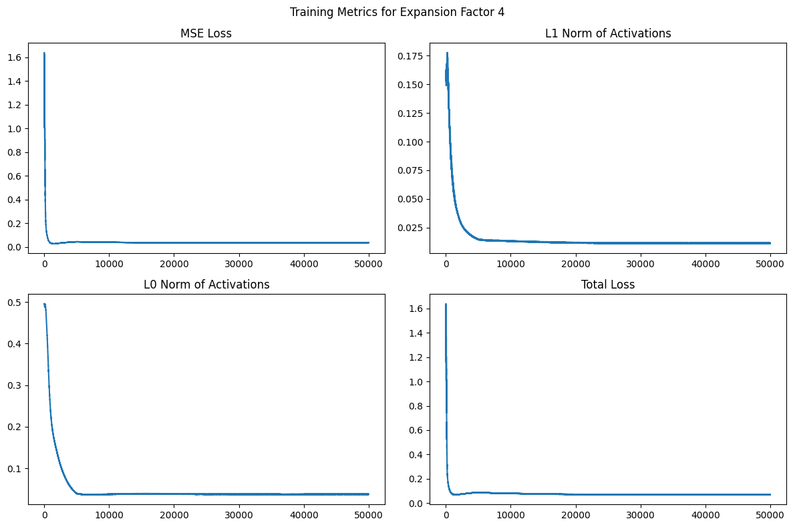

# First pass at mechanistic interpretability with a sparse autoencoder.

## Motivation

The black-box nature of transformer-based large language models (LLMs) makes it quite difficult to understand how and why they generate their output. It’s an area of research I’m very interested in, and in this post I will detail my first attempt at training a Sparse Autoencoder (SAE) from scratch along with some preliminary results.

## Setup

### The model

A basic autoencoder has two parts: an encoder that projects the input vector down to a lower-dimensional vector, and then a decoder that projects the lower-dimensional back to the original size. A Sparse Autoencoder is different in that the intermediate vector (I’ll refer to these as features) is typically larger than the input vectors, and we add an L1 penalty during training to force these features to be sparse. The “expansion factor” is what determines how large the feature vectors are (feature size = embedding dimension x expansion factor). Typical choices of the expansion factor are powers of 2. After training, we look for features that are sparse and activate on tokens in an identifiable way. For example, if one of these features activates strongly on tokens like “Paris,” “Angeles” or “Francisco,” we might infer that it’s capturing some meaning about large cities.

In this project, the SAE takes 512-dimensional residual stream activations as input, projects them up to a larger feature space, applies a ReLU nonlinearity, and then reconstructs the original activation vector. I trained several SAEs with different expansion factors to see how the learned features changed with model width.

Here is the PyTorch code for my Sparse Autoencoder:

```
def SAEloss(xhat: torch.Tensor, x: torch.Tensor, f: torch.Tensor, lam: float = 1e-3) -> torch.Tensor:
    return F.mse_loss(xhat, x) + lam * f.abs().mean()

class SparseAutoEncoder(nn.Module):
    def __init__(self, d: int, m: int):
        super().__init__()
        self.b_pre = nn.Parameter(torch.zeros(d))
        self.b_enc = nn.Parameter(torch.zeros(m))
        self.W_enc = nn.Parameter(torch.nn.init.xavier_normal_(torch.empty(d, m)))
        self.W_dec = nn.Parameter(torch.nn.init.xavier_normal_(torch.empty(m, d)))
        self.renormalize_decoder()
        self.act = nn.ReLU()

    def renormalize_decoder(self) -> None:
        with torch.no_grad():
            self.W_dec.data = self.W_dec.data / self.W_dec.data.norm(dim=1, keepdim=True).clamp_min(1e-12)

    def encoder(self, x: torch.Tensor) -> torch.Tensor:
        x = x - self.b_pre
        x = x @ self.W_enc
        x = x + self.b_enc
        x = self.act(x)
        return x

    def decoder(self, f: torch.Tensor) -> torch.Tensor:
        xhat = f @ self.W_dec
        xhat = xhat + self.b_pre
        return xhat

    def forward(self, x: torch.Tensor) -> tuple[torch.Tensor, torch.Tensor]:
        f = self.encoder(x)
        xhat = self.decoder(f)
        return xhat, f
```

### Training

I used the Pythia-70m model as my baseline model to extract features from, which has 512-dimensional embedding vectors. I then pulled 50k pieces of text from OpenWebText and ran them through the LLM, extracting activations from the residual stream of the third layer at `blocks.3.hook_resid_post`. In total, this produced about 5.88 million token-position activation vectors.

I trained 4 SAEs at expansion factors of 4, 8, 16 and 32. In each model, I used a lambda of 3 in the L1 term of the loss function, a learning rate of 3e-4, and trained for 50k steps. The training setup also included a cosine learning rate schedule with a 2k-step warmup, a warmup on the lambda term, gradient clipping, and decoder row renormalization after each optimizer step.

Here are some training metrics for the 4x expansion model:



One of the practical challenges in this project was simply handling the scale of the activation cache. The full activation tensor is about 12GB on disk, so even on a relatively small baseline model, the engineering side of the experiment mattered quite a bit.

### Ablation

Once we’ve identified a feature that appears to capture meaning about something, the next step is to perform ablation on the residual stream and see how it impacts the subsequent tokens generated by the model. As a query passes through the layers of a transformer-based LLM, the residual stream is where information about the tokens from different layers is stored. When we ablate a given feature, we are effectively removing the information that the tokens for which the feature activates add to the residual stream.

More specifically, I ablate a feature by encoding the residual stream through the SAE, reconstructing that feature’s contribution `f_i * W_dec[i]`, and subtracting it at `blocks.3.hook_resid_post` (the residual stream of the third layer). If the feature I ablated actually contains useful information about the subject of the query, I’d expect the ablated generation to differ from the unchanged model in either its token probabilities or its generated output.

For this first pass, I focused mostly on single-feature ablations and measured the KL divergence between the clean and ablated token distributions, along with changes to the model’s top-5 next-token predictions.

### What worked

I was able to successfully train 4 models at different expansion factors and recover features with a clear pattern. In my 8x model, I found a feature that detected the "Reuters" token, and in my 4x model I found a feature that fired on tokens related to cities or states.

I also found several other clean token-level features in the 8x model, including a "Feb" detector and prefix-like features for tokens such as `" un"` and `" re"`. These are not deep semantic concepts, but they are good evidence that the SAE is learning real structure from the residual stream rather than just failing to train.

### What didn't work

The most interpretable features were often just token recognizers and did not seem to capture any strong causal meaning.

That was the main disappointment in this first pass. The pipeline could clearly recover recognizable features, but the features that were easiest to interpret were often not the ones that most strongly changed model behavior when ablated.

## Interpretable Features

### Feature 1896

Here is an example of an interesting feature I found in my 4x SAE. I was interested in features that corresponded to major cities and found that feature 1896 corresponded to a lot of city- and state-specific tokens. Some of its top activating examples included tokens like `"Angeles"`, `"Georgia"`, `"York"`, `"Vegas"`, `"Paris"`, and `"Arizona"`.

(Note: this feature wasn’t very sparse but its top activating tokens were all quite similar, which is why I wanted to see if it had any causal importance.)

```
Feature 1896 — top 10 activating tokens:

  3.077  token=     ' Angeles'   context: In the following days, stories about the discovery ran in local newspapers and o
  2.990  token=     ' Angeles'   context: Years ago, on a whim, a friend led me into a New Age bookstore in Los Angeles. A
  2.974  token=     ' Georgia'   context: ATLANTA - A Georgia factory worker claims in a federal lawsuit that he was fired
  2.963  token=        ' York'   context: On Thursday, a gay man was sentenced to up to 9 years in prison for assaulting a
  2.960  token=        ' York'   context: The other day I attended a reading by the Hungarian novelist László Krasznahorka
  2.955  token=   ' Francisco'   context: GI Bill's wording costs state's student vets EDUCATION

Paul Miller poses for a 
  2.950  token=       ' Vegas'   context: c/o Lauren Billington

It’s been three weeks since bleary-eyed Floridians woke u
  2.934  token=     ' Arizona'   context: A crowded in-store beer station at a Kroger-owned Fry’s Food Store in Arizona. (
  2.930  token=       ' Paris'   context: The French government suppressed testimony about brutal torture carried out by t
  2.928  token=        ' York'   context: The D.C. Forensic Sciences Department’s new glass-and-steel facility has been ho
```

While the top-1 token after “ York” remained the same after ablation, we can see that the distribution of the top-5 tokens is slightly different. There are also small changes to the top-5 distribution for the second to last token, “ state.” We can also see that the “ York” and “ state” tokens have the highest KL-divergences between the original and ablated distributions.

```
KL divergence per token:

 0   <|endoftext|>  KL=0.000000
 1             The  KL=0.000000
 2        governor  KL=0.000000
 3              of  KL=0.000000
 4             New  KL=0.000000
 5            York  KL=0.072997
 6       announced  KL=-0.000000
 7     legislation  KL=0.000000
 8              to  KL=0.000001
 9         improve  KL=0.000080
10          public  KL=0.000004
11  transportation  KL=0.000006
12              in  KL=0.005954
13             the  KL=0.005579
14           state  KL=0.025738
15               .  KL=0.000357

Top-5 predictions (clean vs ablated):
Position 5: ' York'
  Clean:   [' City', ' is', ',', ' has', ' State']
  Ablated: [' City', ' State', ' is', ' has', ' state']
```

This is not a dramatic causal effect, but it is enough to suggest that the feature is contributing some information related to place names and geographic context.

### Reuters Contrast

One of the most interpretable features in my 8x model was feature 3440, which only fired on `"Reuters"` tokens. This is one of the clearest features in the model. However, after performing ablation on it, I found that this feature had almost no causal impact on token generation.

```
KL divergence per token:

 0   <|endoftext|>  KL=0.000000
 1              In  KL=0.000000
 2               a  KL=0.000000
 3             new  KL=0.000000
 4          report  KL=0.000000
 5            from  KL=0.000000
 6         Reuters  KL=0.013324
 7               ,  KL=0.002602
 8             the  KL=0.000912
 9        governor  KL=0.000021
10              of  KL=0.015196
11             New  KL=0.000627
12            York  KL=0.000229
13                  KL=0.000001

Top-5 predictions (clean vs ablated):
Position 6: ' Reuters'
  Clean:   [',', ' on', ' that', '/', ':']
  Ablated: [',', ' on', ' that', ' and', ':']
```

This was one of the more interesting results from the project. The feature is highly interpretable, but it behaves more like a recognizer than a driver of model behavior. In other words, it seems to identify that a Reuters-style token is present without contributing much to the model’s next-token predictions. Perhaps this is because we are only looking at layer 3 and the LLM is not yet considering complex relationships between tokens.

## Additional observations

Beyond individual feature examples, I also looked at the decoder geometry of the learned features by measuring pairwise cosine similarity between decoder rows. In the 8x model, the maximum off-diagonal similarity was about 0.80 and the mean similarity was about 0.0015. In the 4x model, the maximum was about 0.90 and the mean was about 0.0028.

These numbers suggest that most learned features are close to orthogonal, but there are still a small number of highly similar feature pairs. This is one reason I’m interested in doing more systematic cross-expansion comparisons and multi-feature ablations in the future.

## Conclusion

These findings suggest that while the individual ablations here do not yet provide major interpretability breakthroughs, the SAE recovers interpretable recognizer-like features. The baseline model I’m using, Pythia-70m, is a very small model by today’s standards and I was only looking at the third layer in the residual stream. A larger baseline model would provide more coherent output to begin with, and the early layers of any model capture more information about grammar and spelling than semantic meaning between concepts.

More broadly, this first pass gave me confidence that the pipeline works: I can collect residual-stream activations, train SAEs at multiple widths, recover interpretable features, inspect their geometry, and intervene on them causally. What I have not yet shown is that these features line up cleanly with the most behaviorally important directions in the model.

My next steps are to try batch ablation, multi-feature ablation, and compare features across expansions that capture similar meanings.

## Sources and references

- [Article on SAEs](https://adamkarvonen.github.io/machine_learning/2024/06/11/sae-intuitions.html)
- [Repository with code](https://github.com/sdswitz/mech-int)